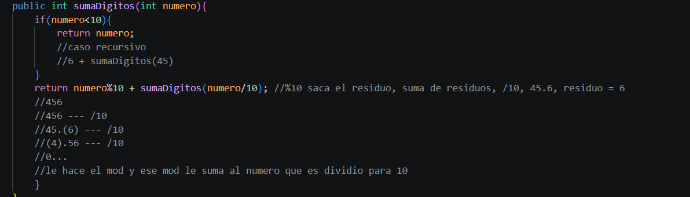

# Universidad Politécnica Salesiana 

## Estructura de datos
## Estudiante: Jose Astudillo

## Practica 2.1 Recursividad
### Fecha: 11/05/2026
### Descripción: 

Abordé el concepto de recursividad como acción de llamar continuamente a una función para lograr un cierto resultado, conociendo
su caso base (condición para que esta se detenga) y la logica u operaciones detras (caso recursivo), considerando también que ciertos métodos de ordenamiento como Quick Sort o Merge Sort

## DESCRIPCION DE LOS EJERCICIOS REALIZADOS
# Ejercicio 3
Este ejercicio se trata de la suma de cada uno de los digitos de un numero, tomé en cuenta que se trata de un entero, no String o
algún arreglo, entonces algunas ideas para realizar la suma quedaron descartadas, pero en si la lógica estuvo en sumar el residuo de dichos numeros a través de la operacion mod ("%") y dividiendo para /10 con cada llamada de la funcion, aplicando asi el concepto de recursividad
